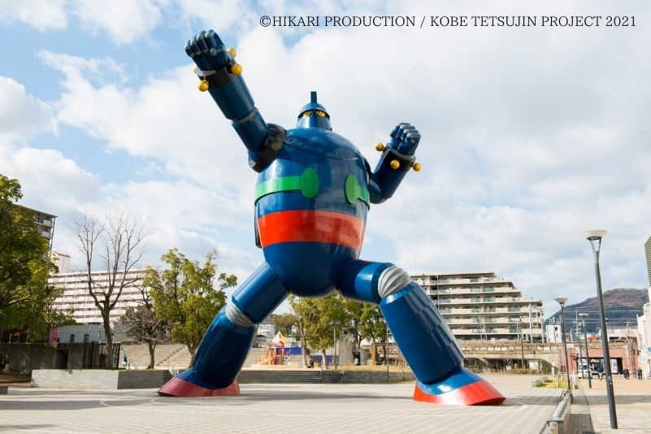

# Elmo2358

兵庫県出身でアイコンは地元にある鉄人28号という巨大ロボットの像です。
team411でJavaScriptの研修を受けてます。

- UEC24
- Ⅱ類1年7クラス

## 所属組織
- [team411](https://www.team411.jp)
- [会計委員会](https://twitter.com/uec___kaikei)
- [非電源ゲーム研究会](https://twitter.com/hidenken_uec)

## やってるゲーム
### ソシャゲ
- FGO
- ブルアカ
- 崩壊スターレイル
- nikke
### PCゲーム
- Varorant
- ドラクエ11S

おすすめあったら教えて下さい。